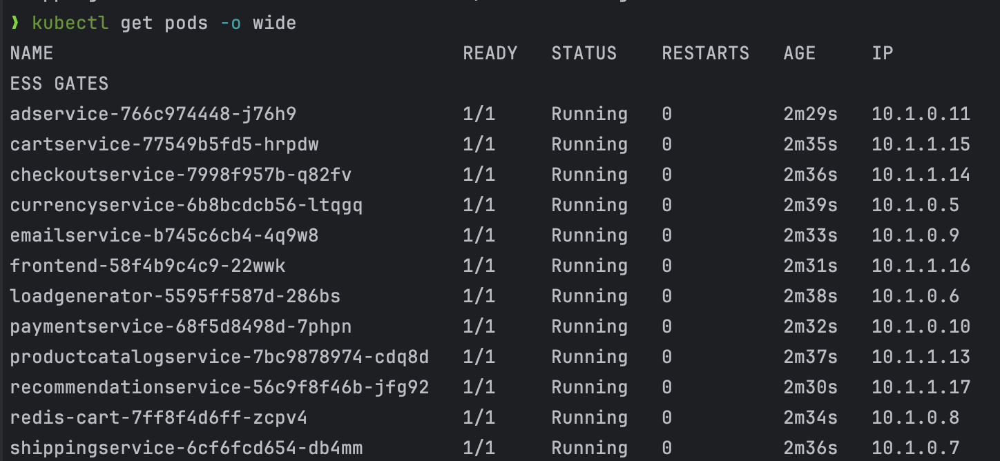
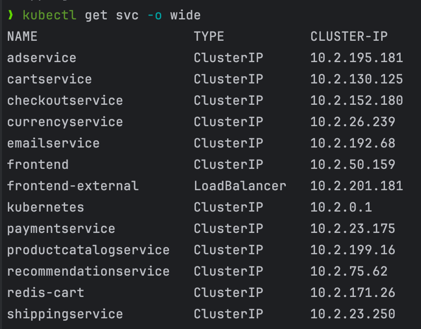

# GKE Demo with Terraform

[](https://github.com/cvitaa11/gke-demo/actions/workflows/main.yml)

This repository contains Terraform configurations to deploy a Google Kubernetes Engine (GKE) cluster with custom networking settings.

## Prerequisites

- [Google Cloud Platform (GCP) Account](https://console.cloud.google.com)
- [Google Cloud SDK](https://cloud.google.com/sdk/docs/install)
- [Terraform](https://www.terraform.io/downloads.html)
- GCP Project with required APIs enabled:
    - Compute Engine API
    - Kubernetes Engine API
    - Cloud Resource Manager API

## Network Configuration

The cluster is configured with the following IP ranges:
- Nodes: 10.0.0.0/16
- Pods: 10.1.0.0/16
- Services: 10.2.0.0/16

Example output:



## Usage

1. Clone the repository:
```bash
git clone https://github.com/cvitaa11/gke-demo.git
cd gke-demo/infra/example
```

2. Create a `terraform.tfvars` file with your project settings:
```bash
project_id     = "your-project-id"
region         = "your-desired-region"
node_locations = ["your-desired-AZs"]
```
3. Initialize Terraform
```bash
terraform init
```
4. Review the plan:
```bash
terraform plan
```
5. Apply the configuration:
```bash
terraform apply
```
6. After deployment, configure kubectl:
```bash
gcloud container clusters get-credentials $(terraform output -raw kubernetes_cluster_name) --region $(terraform output -raw region)
```

## Terraform resources

| Name                                                                      | Version  |
|---------------------------------------------------------------------------|----------|
| <a name="requirement_terraform"></a> [terraform](#requirement\_terraform) | ~> 1.5.7 |
| <a name="requirement_google"></a> [google](#requirement\_google)          | 6.8.0    |

## Providers

| Name                                                       | Version |
|------------------------------------------------------------|---------|
| <a name="provider_google"></a> [google](#provider\_google) | 6.8.0   |

## Resources

| Name                                                                                                                                                       | Type        |
|------------------------------------------------------------------------------------------------------------------------------------------------------------|-------------|
| [google_compute_network.vpc](https://registry.terraform.io/providers/hashicorp/google/6.8.0/docs/resources/compute_network)                                | resource    |
| [google_compute_subnetwork.subnet](https://registry.terraform.io/providers/hashicorp/google/6.8.0/docs/resources/compute_subnetwork)                       | resource    |
| [google_container_cluster.primary](https://registry.terraform.io/providers/hashicorp/google/6.8.0/docs/resources/container_cluster)                        | resource    |
| [google_container_node_pool.primary_nodes](https://registry.terraform.io/providers/hashicorp/google/6.8.0/docs/resources/container_node_pool)              | resource    |
| [google_container_engine_versions.gke_version](https://registry.terraform.io/providers/hashicorp/google/6.8.0/docs/data-sources/container_engine_versions) | data source |

## Inputs

| Name                                                                                   | Description                        | Type     | Default         | Required |
|----------------------------------------------------------------------------------------|------------------------------------|----------|-----------------|:--------:|
| <a name="input_node_ip_range"></a> [node\_ip\_range](#input\_node\_ip\_range)          | IP address range of GKE nodes      | `string` | `"10.0.0.0/16"` |    no    |
| <a name="input_node_locations"></a> [node\_locations](#input\_node\_locations)         | Availability zone of the GKE nodes | `any`    | n/a             |   yes    |
| <a name="input_pod_ip_range"></a> [pod\_ip\_range](#input\_pod\_ip\_range)             | IP address range of k8s pods       | `string` | `"10.1.0.0/16"` |    no    |
| <a name="input_project_id"></a> [project\_id](#input\_project\_id)                     | GCP project id                     | `any`    | n/a             |   yes    |
| <a name="input_region"></a> [region](#input\_region)                                   | region                             | `string` | `"us-east1"`    |    no    |
| <a name="input_service_ip_range"></a> [service\_ip\_range](#input\_service\_ip\_range) | IP address range of k8s services   | `string` | `"10.2.0.0/16"` |    no    |

## Outputs

| Name                                                                                                          | Description      |
|---------------------------------------------------------------------------------------------------------------|------------------|
| <a name="output_kubernetes_cluster_host"></a> [kubernetes\_cluster\_host](#output\_kubernetes\_cluster\_host) | GKE Cluster Host |
| <a name="output_kubernetes_cluster_name"></a> [kubernetes\_cluster\_name](#output\_kubernetes\_cluster\_name) | GKE Cluster Name |
| <a name="output_region"></a> [region](#output\_region)                                                        | GCloud Region    |

## Cleanup
To destroy the created resources run the following command:
```bash
terraform destroy
```

## Notes
- The configuration uses minimal resources to stay within GCP's free tier
- The cluster is deployed in a single zone for cost optimization
- Remember to monitor your GCP usage and costs